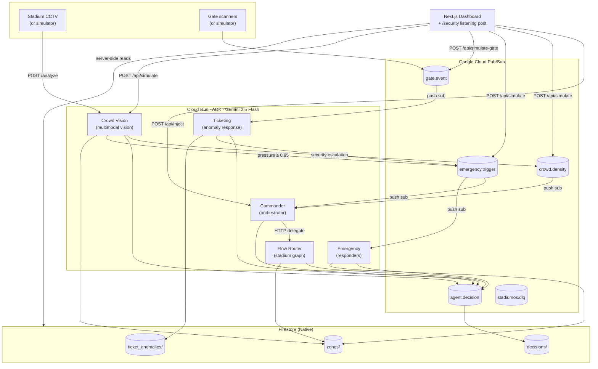

# StadiumOS

> An agentic command platform for cricket-stadium operations: 5 specialised Gemini agents that cooperate over Google Cloud Pub/Sub to prevent stampedes, dispatch responders, and manage gate-flow anomalies — in real time, autonomously.

Submission for **Google Cloud — Build with AI: Agentic Premier League**.

---

## 🌐 Live URLs

| Service | URL |
|---|---|
| **Dashboard** (ops view) | <https://stadiumos-dashboard-406816938729.asia-south1.run.app> |
| **Security listening post** (audio alerts) | <https://stadiumos-dashboard-406816938729.asia-south1.run.app/security> |
| Commander API | <https://commander-agent-406816938729.asia-south1.run.app> |
| Crowd Vision API | <https://crowd-vision-agent-406816938729.asia-south1.run.app> |
| Flow Router API | <https://flow-router-agent-406816938729.asia-south1.run.app> |
| Emergency API | <https://emergency-agent-406816938729.asia-south1.run.app> |
| Ticketing API | <https://ticketing-agent-406816938729.asia-south1.run.app> |

**60-second demo**: open the dashboard → click *Reset demo* → click the purple *Pre-Crime stampede simulator* → watch all 5 agents collaborate over ~25 seconds. The North stand turns red, a cyan arrow redirects fans to the North West, security units are dispatched, gate anomalies trigger Ticketing — every step logged to Firestore, every reasoning step visible in the activity feed.

---

## The problem (one paragraph)

Cricket matches at 80,000-seat venues create exit surges, queue bottlenecks, and emergency situations faster than human ops teams can manually coordinate the response. The problem statement asks for an integrated, real-time command platform that **unifies ticketing, dynamically routes crowd flow, and automates emergency responses** for a safe and seamless fan experience. StadiumOS does exactly that, with 5 cooperating AI agents.

---

## Architecture at a glance



### Read this picture left-to-right

1. **Input** — real CCTV frames (or the simulator) feed Crowd Vision; gate scanners (or the simulator) feed `gate.event`.
2. **Event bus** — 5 Pub/Sub topics carry everything. Each topic has a push subscription that wakes the right agent on Cloud Run with an OIDC-signed POST.
3. **Agents** — five small ADK agents, each with Gemini 2.5 Flash, a tight system prompt, and 2–3 tools. None of them know about each other directly; they talk only via the bus + HTTP.
4. **State** — Firestore is the single source of truth that the dashboard renders. Every meaningful agent action writes both an `AgentDecision` row (audit trail) and a zone/gate patch.
5. **UI** — the Next.js dashboard polls Firestore every 1.5s and shows a digital twin of the stadium plus a live activity feed. A separate `/security` page is an audio-first listening post for the ops room.

---

## The 5 agents

| # | Agent | Role | Subscribes to | Publishes to | Tools |
|---|---|---|---|---|---|
| 1 | **Commander** | Orchestrator. Receives signals, decides which specialist to delegate to. | `crowd.density`, `emergency.trigger` | `agent.decision`, `emergency.trigger` | `delegate_task`, `query_zone_state`, `escalate_emergency` |
| 2 | **Crowd Vision** | Multimodal Gemini Vision over stadium camera frames. Counts heads, computes pressure_index = occupancy × \|velocity\|, detects stampede precursors (falling, bottlenecks, counter-flow). | direct `/analyze` HTTP | `crowd.density`, `agent.decision`, `emergency.trigger` (auto-escalate at pressure ≥ 0.85) | `report_density`, `flag_stampede_risk` |
| 3 | **Flow Router** | Computes safe crowd redirections across a static 8-stand × 8-gate graph. Closes/opens gates, sends overflow only to neighbours under 75% occupancy. | called by Commander via HTTP | `agent.decision`, Firestore `zones/<zone>.active_route_plan` | `query_stadium_graph`, `assign_route` |
| 4 | **Emergency** | Dispatches responders (medical / fire / security), locks down zones, notifies external agencies (EMS, city police, fire dept). | `emergency.trigger` | `agent.decision`, Firestore `zones/<zone>.active_dispatch` / `.lockdown` | `dispatch_responder`, `lockdown_zone`, `notify_authorities` |
| 5 | **Ticketing** | Reacts to anomalous gate events (duplicate scans, invalid tickets, throughput drops). Can escalate organised abuse to security. | `gate.event` (filters `scan_ok` upstream) | `agent.decision`, `emergency.trigger` (on abuse), Firestore `ticket_anomalies/`, `gates/<id>.pending_action` | `log_anomaly`, `request_gate_staffing`, `escalate_to_security` |

Every agent has the same shape — same audit-row format, same one-round-of-tools-then-summarise system prompt rule, same `max_llm_calls=4` cap on the ADK runner so a hallucinated loop can't run away.

---

## Scalability + security

### How it scales

| Property | Mechanism |
|---|---|
| Agent autoscaling | Each agent is a Cloud Run service with `max-instances=5` and scale-to-zero. Cost is ~zero when idle; capacity grows with traffic. |
| Decoupled fan-out | Pub/Sub is the spine. Adding a new subscriber (e.g. a Comms agent for PA broadcasts) doesn't require touching any existing service — just register a new push subscription. |
| Push not pull | All agents react to push subscriptions (Pub/Sub → Cloud Run), so there are no long-poll workers, no idle compute, and acks are managed by Pub/Sub. |
| Dead-letter | Every subscription has `dead_letter_policy → stadiumos.dlq` with `max_delivery_attempts=5` and 10s→600s exponential retry — bad messages never wedge a subscriber. |
| Idempotency | Agents are written to be safe on redelivery (every action is keyed by an explicit zone/gate, every decision is a fresh Firestore doc — no implicit state). |
| Quota awareness | Vertex AI Gemini quota is the binding constraint at hackathon scale. The simulator deliberately uses Flash (not Pro) and the ADK runner enforces a 4-call cap so one Commander invocation can't burn through quota. |

### How it's secured

| Layer | Approach |
|---|---|
| Service identity | One dedicated runtime service account (`stadiumos-runtime@...`) used by every service. Scoped roles: `aiplatform.user`, `pubsub.publisher` + `subscriber` + `editor`, `datastore.user`, `secretmanager.secretAccessor`, logging/monitoring/trace. |
| Pub/Sub → Cloud Run | Push subscriptions sign each delivery with an OIDC token issued for the runtime SA, audience = the target service URL. `run.invoker` is granted on each agent for that SA. |
| Bearer auth on `/invoke` and `/analyze` | A shared `STADIUMOS_API_TOKEN` (from env var) gates HTTP entry points on every agent. `/pubsub` stays open (relies on Pub/Sub OIDC instead). Dashboard injects the token on outgoing calls. |
| Rate limiting | In-memory per-endpoint cooldown on the dashboard: `/api/inject` 5s, `/api/simulate` 30s, `/api/simulate-gate` 20s, `/api/reset` 5s. Single-instance scope; production would back this with Redis. |
| Secrets | Secret Manager only, never `.env` in repo. The `.gitignore` blocks every common secret pattern. |
| Audit trail | Every agent action writes an `AgentDecision` row containing `agent`, `input_summary`, `reasoning`, `output`, `confidence`, `ts`. This is what regulators would ask for after an incident. |

### What we deliberately did **not** harden (and why)

- Cloud Run services are `--allow-unauthenticated` for the live hackathon demo so judges can hit URLs directly. The bearer-token layer above still rejects abuse; tightening to IAM-only is a one-line `gcloud run` change.
- We don't yet ship a Comms agent that fans out alerts to Twilio / WhatsApp / digital signage. The bus is ready; the `/security` page provides browser-TTS in the meantime.

---

## Infrastructure (Google Cloud)

| Resource | Identity | Notes |
|---|---|---|
| GCP project | `gen-lang-client-0636377017` | Billing enabled |
| Region | `asia-south1` (Mumbai) | All compute + storage |
| Vertex AI | `us-central1` (cross-region) | Gemini 2.5 Flash for every agent — not yet GA in asia-south1 |
| Firestore | `(default)` Native mode | Free tier; PITR off (demo only) |
| Pub/Sub topics | `crowd.density`, `gate.event`, `emergency.trigger`, `agent.decision`, `weather.update`, `stadiumos.dlq` | 1-day retention, DLQ with 5 retry attempts |
| Push subscriptions | `commander-crowd-density`, `commander-emergency`, `emergency-trigger-handler`, `ticketing-gate-event-handler` | OIDC-signed, 60s ack deadline |
| Artifact Registry | `asia-south1-docker.pkg.dev/.../stadiumos` | Docker images for all 6 services |
| Cloud Run services | `commander-agent`, `crowd-vision-agent`, `flow-router-agent`, `emergency-agent`, `ticketing-agent`, `stadiumos-dashboard` | `1Gi` RAM × `1` vCPU × `5` max-instances each |
| IAM | One service account `stadiumos-runtime` | See [Scalability + security](#scalability--security) |
| Terraform / OpenTofu | `/infra/*.tf` | Owns Pub/Sub topics + push subscriptions + IAM bindings |

---

## Repo layout

```
googlefinal/
├── agents/
│   ├── commander/        # ADK + FastAPI · /invoke + /pubsub
│   ├── crowd-vision/     #             · /analyze (multimodal)
│   ├── flow-router/      #             · /invoke + static 8-stand graph
│   ├── emergency/        #             · /invoke + /pubsub
│   └── ticketing/        #             · /invoke + /pubsub (filters scan_ok)
├── shared/
│   └── stadiumos_shared/ # Pydantic event schemas, Pub/Sub + Firestore helpers, bearer auth
├── web/                  # Next.js 16 dashboard (App Router, Tailwind 4, TS)
│   ├── app/
│   │   ├── page.tsx              # /         — operations dashboard
│   │   ├── security/page.tsx     # /security — audio-first listening post
│   │   └── api/
│   │       ├── state/route.ts    # GET     Firestore snapshot (zones + decisions)
│   │       ├── agents/route.ts   # GET     5-agent health probe
│   │       ├── inject/route.ts   # POST    free-text → Commander
│   │       ├── simulate/route.ts # POST    Pre-Crime sequence → all 5 agents
│   │       ├── simulate-gate/route.ts # POST gate anomalies → Ticketing
│   │       └── reset/route.ts    # POST    purge Pub/Sub + Firestore
│   ├── components/       # Stadium SVG, ActivityFeed, InjectPanel, SpeechToggle, SecurityListener…
│   └── lib/              # firestore.ts, pubsub.ts, auth.ts, ratelimit.ts, voices.ts
├── infra/                # OpenTofu/Terraform — Pub/Sub topics, subscriptions, IAM
├── scripts/simulators/   # legacy local data generators (now superseded by /api/simulate*)
└── CLAUDE.md             # internal coding conventions + architecture decisions
```

---

## How to run it

### Prerequisites
- Google Cloud project with billing enabled
- `gcloud` ≥ 470, `gcloud auth application-default login`
- `node` ≥ 22, `pnpm` 9
- `python` ≥ 3.12, `pip` (only needed for agent dev)
- `opentofu` 1.6+ (or `terraform` 1.6+)

### One-shot setup

```bash
# Enable APIs
gcloud services enable \
  aiplatform.googleapis.com run.googleapis.com cloudbuild.googleapis.com \
  pubsub.googleapis.com firestore.googleapis.com eventarc.googleapis.com \
  secretmanager.googleapis.com artifactregistry.googleapis.com iam.googleapis.com

# Create Firestore (Native)
gcloud firestore databases create --location=asia-south1 --type=firestore-native

# Create runtime SA + Artifact Registry — see infra/README for the exact roles
# (Terraform manages the rest)

cd infra && tofu init && tofu apply
```

### Build + deploy all 6 services

```bash
# From repo root
for svc in commander crowd-vision flow-router emergency ticketing; do
  gcloud builds submit --config agents/$svc/cloudbuild.yaml .
done
gcloud builds submit --config web/cloudbuild.yaml .

# Deploy each (env vars vary per service — see agents/<svc>/README.md)
gcloud run deploy commander-agent --image ... --set-env-vars ...
# (etc.)
```

Each agent's `README.md` has the exact `gcloud run deploy` line. The dashboard needs `COMMANDER_URL` + per-agent URLs as env vars so its `/api/agents` health probe and `/api/inject` proxy work.

### Local dev

```bash
# Each agent (in its own terminal)
cd agents/commander
pip install -e ../../shared -e .
export $(grep -v '^#' ../../.env.example | xargs)
uvicorn commander_agent.main:app --reload --port 8080

# Dashboard
cd web
cp .env.local.example .env.local        # COMMANDER_URL + GCP_PROJECT_ID
pnpm install && pnpm dev                # http://localhost:3000
```

---

## Demo guide

The dashboard has 5 trigger buttons — two "fast" programmatic simulators and three natural-language scenarios.

| Trigger | What it does | Agents that fire |
|---|---|---|
| **🟣 Pre-Crime stampede simulator** | Publishes 8 rising `crowd.density` frames over ~18s + kicks Crowd Vision via `/analyze` (real Gemini Vision call) + 2 gate anomalies. Crosses the auto-escalate threshold mid-sequence → also fires `emergency.trigger`. | **All 5** |
| **🩷 Ticketing anomaly simulator** | Publishes 4 gate.event anomalies (2× scan_dup, 1× scan_invalid, 1× throughput drop) | Ticketing (+ optionally Emergency on escalation) |
| Stampede precursor (text) | Sends Commander: *"North Stand at 87%, inward velocity 1.2 m/s"* | Commander → Flow Router |
| Medical emergency (text) | Sends Commander: *"Fan collapsed in East Stand section E-14"* | Commander → Emergency (dispatches to **East**) |
| Rain incoming (text) | Sends Commander: *"Heavy rain in 8 min, pre-position staff"* | Commander → (Comms — not built yet, fails gracefully) |

The **🔊 Speaking** toggle in the header reads each decision aloud through `window.speechSynthesis`. The `/security` page is the same idea but full-screen and PA-style — designed to be left open on a wall-mounted screen in the ops room.

---

## Tech stack

- **Agents**: Python 3.12 · Google ADK · Vertex AI · Gemini 2.5 Flash · FastAPI · Uvicorn · Pydantic · structlog
- **Event bus**: Google Cloud Pub/Sub (push subscriptions, OIDC-signed)
- **State**: Firestore (Native mode)
- **Frontend**: Next.js 16 (App Router) · React 19 · Tailwind 4 · TypeScript 5 · pnpm 9
- **Infra**: OpenTofu 1.12 · Cloud Run · Artifact Registry · Cloud Build
- **Region**: `asia-south1` for compute + state; `us-central1` for Vertex AI calls (Gemini 2.5 isn't in Mumbai yet)
- **Observability**: Cloud Logging + Cloud Trace (auto-wired); every agent decision also written to Firestore `decisions/`

---

## Rubric coverage (Phase 1: 45 pts · Phase 2: 50 pts)

| Category | How we cover it |
|---|---|
| **Functional Fulfillment (15)** | All three pillars from the problem statement: Ticketing agent (gate anomalies), Flow Router (crowd redirection), Emergency (responder dispatch). Wired end-to-end, verifiable in <30s on the live dashboard. |
| **Scalability & Security (10)** | Cloud Run scale-to-zero · push subscriptions · DLQ · OIDC for Pub/Sub · bearer auth on /invoke · rate limiting · scoped IAM. Inline docs above. |
| **Static Code Analysis (15)** | This repo. 5 agents share a Pydantic event schema + helper library, every decision is typed, no dead code, every README has a deploy recipe. |
| **GCP Deploy bonus (5)** | All 6 services live in Cloud Run. URLs at the top. |
| **Innovation & Agentic Depth (15)** | 5 cooperating agents, event-driven via Pub/Sub, real LLM tool-calling on every step. One Pre-Crime click chains Crowd Vision (multimodal Gemini Vision) → Commander → Flow Router → Emergency + Ticketing in parallel. |
| **Live Demo Execution (10)** | One-button autonomous demo + `/security` audio-first view + Live Status panel that narrates agent state in plain English. |
| **Presentation & Pitching (10)** | This README + the dashboard's own annotations are the pitch. |
| **Q&A & Technical Defense (15)** | Architecture defensible end-to-end; every "why did the agent do X?" question has a Firestore `decisions/` row to answer it. |

---

## License

Hackathon submission — internal use only. Not licensed for commercial deployment.
